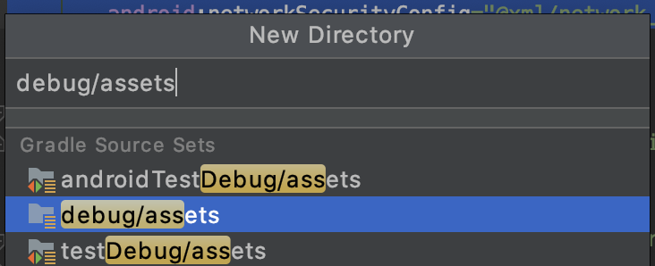

# Bus timetable retrofit kotlin application

## Description

A Kotlin Application that uses Dublin bus API to show when the next available bus will arrive. It uses Retrofit and MockWebServer to mock apis.

## Contents

- [Setup Steps](#setup-steps)
- [How to run the project locally](#how-to-run-the-project-locally)
- [Tools](#tools)
- [Update Dependencies](#update-dependencies)
- [Releases](#releases)
- [Helpful resources](#helpful-resources)

## Setup Steps

Go to the app module build.gradle and add the following dependencies

```kotlin
implementation 'com.github.bumptech.glide:glide:4.9.0'
implementation 'androidx.cardview:cardview:1.0.0'
implementation 'com.squareup.retrofit2:retrofit:2.8.1'
implementation 'com.squareup.retrofit2:converter-gson:2.8.1'
implementation 'com.squareup.retrofit2:converter-moshi:2.4.0'
implementation "androidx.recyclerview:recyclerview:1.1.0"
implementation "com.squareup.okhttp3:okhttp:4.4.0"
androidTestImplementation "com.squareup.okhttp3:mockwebserver:4.4.0"
androidTestImplementation 'com.jakewharton.espresso:okhttp3-idling-resource:1.0.0'
androidTestImplementation 'androidx.test:rules:1.2.0'
androidTestImplementation 'androidx.test:runner:1.2.0'
debugImplementation 'com.facebook.flipper:flipper:0.50.0'
debugImplementation 'com.facebook.soloader:soloader:0.9.0'
releaseImplementation 'com.facebook.flipper:flipper-noop:0.50.0'

repositories {
    jcenter()
}
```

Go to the `AndroidManifest.xml` and allow internet permission

```kotlin
<uses-permission android:name="android.permission.INTERNET"/>
```

In the `AndroidManifest.xml`, make sure you add the name of the application you will use, in this instance it is `BusApp`.

```kotlin
android:name="BusApp"
```

In the `AndroidManifest.xml`, make sure you add the following or you may have issues using the MockTestRunner.

```kotlin
android:usesCleartextTraffic="true"
```

To store out json files like `success_response.json` we want it stored in the following directory path `app/src/debug/assets/success_response.json`. See the below image on how to create that debug directory

<p></p>

In the `styles.xml`, make sure you change the style's parent if you don't want to show the action bar

```kotlin
<style name="AppTheme" parent="Theme.AppCompat.Light.NoActionBar">
```

The api we are fetching is not a normal list, it is an object that contains an array `results`, in the array `results` has the list of data we want. See how this api is different from other apis.

```kotlin
{
  "errorcode": "0",
  "errormessage": "",
  "numberofresults": 3,
  "stopid": "184",
  "timestamp": "08/07/2020 23:29:20",
  "results": [
    {
      "arrivaldatetime": "08/07/2020 23:31:42",
      "duetime": "2222",
      "departuredatetime": "08/07/2020 23:31:42",
      "departureduetime": "2",
      "scheduledarrivaldatetime": "08/07/2020 23:33:00",
      "scheduleddeparturedatetime": "08/07/2020 23:33:00",
      "destination": "O'Connell St",
      "destinationlocalized": "Sr. Uí Chonaill",
      "origin": "Harristown",
      "originlocalized": "Baile Anraí",
      "direction": "Outbound",
      "operator": "bac",
      "operatortype": "1",
      "additionalinformation": "",
      "lowfloorstatus": "no",
      "route": "4",
      "sourcetimestamp": "08/07/2020 23:24:15",
      "monitored": "true"
    },
```

In the `AndroidManifest.xml`, make sure you add the following for Flipper debugger

```kotlin
<activity android:name="com.facebook.flipper.android.diagnostics.FlipperDiagnosticActivity"
        android:exported="true"/>
```

In the `BusApp.kt`, which is our application class, make sure you add the following for Flipper debugger

```kotlin
override fun onCreate() {
    super.onCreate()
    SoLoader.init(this, false)
    if (BuildConfig.DEBUG && FlipperUtils.shouldEnableFlipper(
            this
        )
    ) {
        val client = AndroidFlipperClient.getInstance(this)
        client.addPlugin(InspectorFlipperPlugin(this, DescriptorMapping.withDefaults()))
        client.start()
    }
}
```

To use Proxyman on an Android Emulator, look at the following documentation [link](https://docs.proxyman.io/debug-devices/android-device/sample-android-project).

Firstly, add the following to `AndroidManifest.xml`

```kotlin
        android:networkSecurityConfig="@xml/network_security_config"
```

Then create the following file `res/xml/network_security_config.xml` and add the following

```kotlin
<?xml version="1.0" encoding="utf-8"?>
<network-security-config>
    <!--Set application-wide security config using base-config tag.-->
    <!--Set domain-specific security config using domain-config tags. -->
    <!--See https://developer.android.com/training/articles/security-config.html for more information.-->
    <debug-overrides>
        <trust-anchors>
            <!-- Trust user added CAs while debuggable only -->
            <certificates src="system" />
            <certificates src="user" />
        </trust-anchors>
    </debug-overrides>
    <base-config cleartextTrafficPermitted="true">
        <trust-anchors>
            <certificates src="system" />
        </trust-anchors>
    </base-config>

    <domain-config>
        <domain includeSubdomains="true">www.google.com</domain>
        <trust-anchors>
            <certificates src="user"/>
            <certificates src="system"/>
        </trust-anchors>
    </domain-config>
</network-security-config>
```

Look at the documentation mentioned above on how to setup a Proxyman on a Pixel 3 emulator.

**Important to note if running test directly via localhost:**

If for example we wanted to create a new `Phone and Tablet module` that copied another module that had a live url and in this module we just used the `localhost` instead of a live url, we wouldn't then need `BusTestApp.kt` and `MockTestRunner.kt` and we would need to update the `FileReader.kt` to be the following

```kotlin
import androidx.test.platform.app.InstrumentationRegistry
import java.io.IOException
import java.io.InputStreamReader

object FileReader {
    fun readStringFromFile(fileName: String): String {
        try {
            val inputStream = InstrumentationRegistry.getInstrumentation().targetContext
                .applicationContext.assets.open(fileName)
            val builder = StringBuilder()
            val reader = InputStreamReader(inputStream, "UTF-8")
            reader.readLines().forEach {
                builder.append(it)
            }
            return builder.toString()
        } catch (e: IOException) {
            throw e
        }
    }
}
```

## How to run the project locally

To run the unit tests locally.

```kotlin
./gradlew testdebugUnitTest
```

To run the ui tests locally, but first we need an emulator to be open.

```kotlin
./gradlew connectedCheck
```

To create `app-debug.apk` with fastlane locally, run the following.

```kotlin
bundle exec fastlane beta
```

To upldoad `app-debug.apk` to App Center with fastlane locally, run the following.

```kotlin
bundle exec fastlane upload_to_app_center
```

## Tools

**Linter:** we use the following linter [link](https://github.com/github/super-linter).

**Uploading Artifacts:**  we use the following way to upload Artifacts, they allow you to persist data like test results after a job has completed, see the following documentation [link](https://docs.github.com/en/actions/configuring-and-managing-workflows/persisting-workflow-data-using-artifacts).

**Creating a Mock Server:** we use a mock server with Postman to quickly test apis, to see how to create a mock server, see the following video [link](https://www.youtube.com/watch?v=rJY8uUH2TIk). 

### Mobile Specific Tools:
 
**Fastlane:** Fastlane allows us to automate our development and release process [link](https://docs.fastlane.tools/).

**App Center:** App Center is used to distribute an app, making it very easy to test on a physical device by using a fastlane plugin [link](https://github.com/microsoft/fastlane-plugin-appcenter).

## Update Dependencies

**Npm:** How to update a npm package.
- [link](https://docs.npmjs.com/cli/update).

**Gemfile:** How to update a Gemfile package.
- [link](https://bundler.io/man/bundle-update.1.html#UPDATING-A-LIST-OF-GEMS).

## Releases

How to manage releases in a repository [link](https://help.github.com/en/github/administering-a-repository/managing-releases-in-a-repository). 

## Helpful resources

The following link provides very helpful information on Retrofit and mocking using MockWebServer.
- [link](https://www.raywenderlich.com/10091980-testing-rest-apis-using-mockwebserver).

The following link goes into leveling up your ui tests with MockWebServer
- [link](https://tech.okcupid.com/ui-tests-with-mockwebserver/).

The following link provides a guide on consuming apis with Retrofit
- [link](https://github.com/codepath/android_guides/wiki/Consuming-APIs-with-Retrofit).

The following link helps if you get the following error `Failed to open QEMU pipe 'qemud:network': Invalid argument`.
- [link](https://stackoverflow.com/a/57726127).

The following link provides information if you failed to define the application in the manifest.
- [link](https://stackoverflow.com/a/10607418).

The following link provides information on how to use the image dependency Glide, which is good for gifs.
- [link](https://github.com/bumptech/glide).

The following link provides information on how to use the debugging tool Flipper for Android.
- [link](https://fbflipper.com/docs/getting-started/android-native).

The following link provides information on how to convert from using Gson to Moshi.
- [link](https://proandroiddev.com/moshi-with-retrofit-in-kotlin-%EF%B8%8F-a69c2621708b).

The following link provides Moshi's official github which provides examples on how to use Moshi.
- [link](https://github.com/square/moshi).

The following link provides info on setting up code coverage with the JaCoCo plugin.
- [link](https://www.raywenderlich.com/10562143-continuous-integration-for-android#toc-anchor-013).

The following link provides info on Unresolved reference: kotlinx.
- [link](https://stackoverflow.com/a/34173727).

The following link provides info on how to setup Proxyman on Android.
- [link](https://docs.proxyman.io/debug-devices/android-device/sample-android-project).

The following link provides info on how to setup a corresponding link url in the Github Actions interface.
- [link](https://docs.github.com/en/actions/deployment/targeting-different-environments/using-environments-for-deployment).
